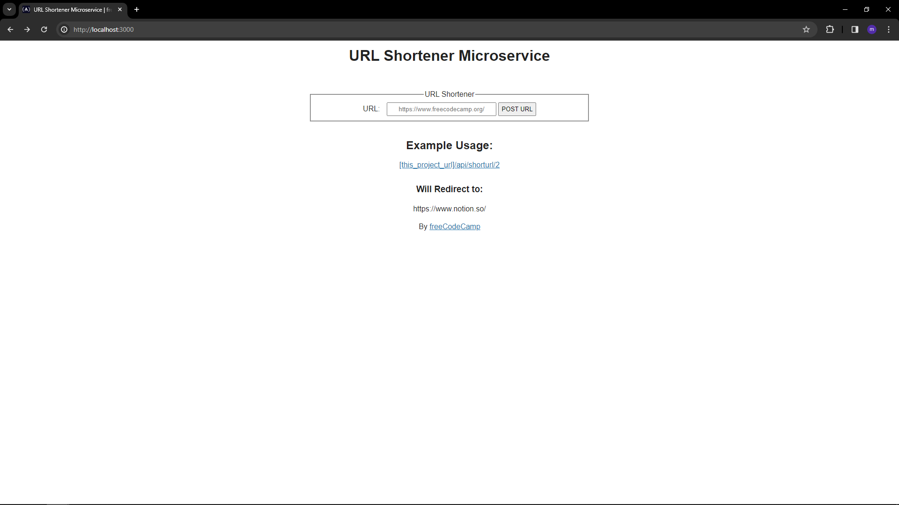

# URL Shortener Microservice

This is a simple project from <a href="www.freecodecamp.com">freecodecamp</a>. but I change the folder structure (MVC). I also added some test to it

<h2>Follow these steps to run this project</h2>

<ol>
<li>Git Clone the project</li>
<li>create your own .env</li>
<li>add your monggo_url in .env</li>
<li>add your NODE_ENV in .env and put '<>test'</li>
<li>run: npm install</li>
<li>run: npm run watch</li>
</ol>

<h3>TO USE</h3>
<ul>
<li> Run the project</li>
<li> Click the link</li>
<li> Enjoy (if you want to)</li>
</ul>
<h3>TO RUN TEST </h3>

- add 'text' to your 'NODE_ENV' in .env
- run: npm run test-watch

<h3>NOTES</h3>

- Make sure you have node installed

<h3>Technology used</h3>

- Node.js
- Express.js
- Jest
- Mongodb
